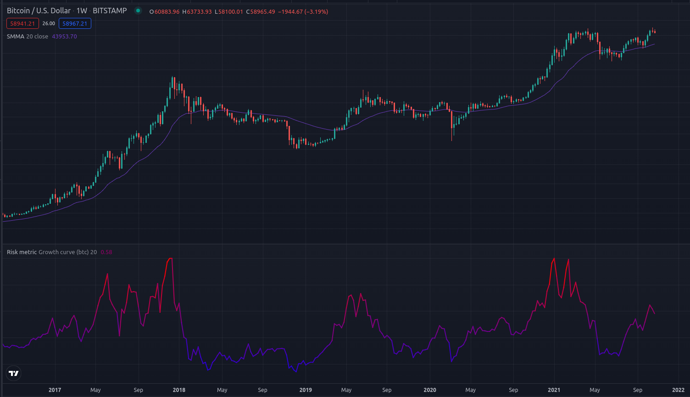
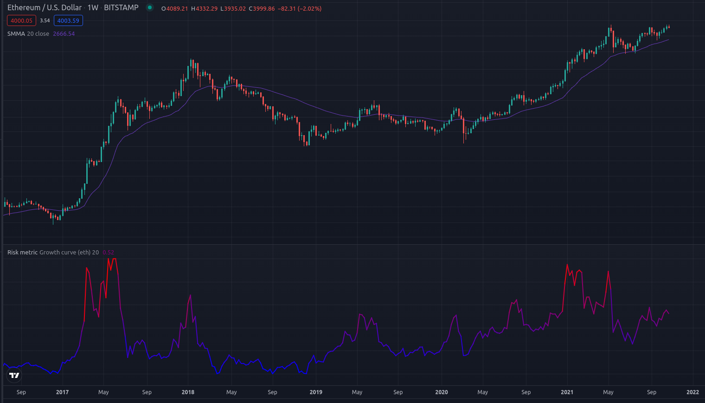

### Risk metric for bitcoin and ethereum

* This risk metric can be used in tradingview by simply copying the code and pasting it in the strategy builder. 

Risk model for crypto currencies. Takes the fraction of the weekly close and a slower moving average, nomarlizes this fraction from the beginning of time. Compensates the fraction with a logarithmic growth band to accomodate for lesser procentage moves as the marketcap goes higher. Lets the user choose the moving average and supporting logarithmic band from bitcoin or ethereum. 

##### Examples

##### Thanks 

* Big thanks to Benjamin Cowen, for inspiration to the risk metric. Worth noting that this is an approximation to his risk-metric, his risk-metric is private and may take alot more into account. 

* Thanks to quantadelic (tradingview) for the code to the logarithmic growth curves used in adjusting the risk. 

##### Future work
* Add logarithmic growth compensation for other popular cryptocurrencies.  
