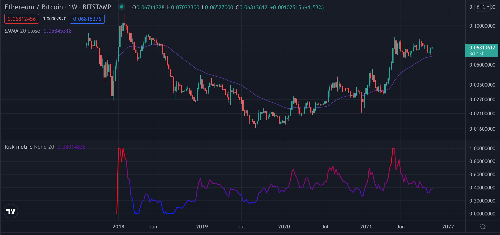

### Risk metric for bitcoin and ethereum

* This risk metric can be used in tradingview by simply copying the code and pasting it in the strategy builder. 
##### Usage
* Risk model for crypto currencies. Takes the fraction of the weekly close and a slower moving average, nomarlizes this fraction from the beginning of time. 

1. (Optional) Compensates the fraction with the logarithmic growth band.
    This accomodates for smaller procentage moves as the marketcap goes higher. (Ideally each market cycle peak would reach a risk level very close to one)

    Currently supported coins:
    * bitcoin 
    * ethereum
2. (Option) Lets the user choose the moving average of the fraction. 
3. (Option) Lets the user log the fraction. 
    This option stretches the risk model towards the edges (zero or one), putting more emphesis on local bottoms and highs. 

##### Examples
* Risk metric for bitcoin

* Risk metric for ethereum

* Risk metric eth/btc

##### Thanks 

* Big thanks to Benjamin Cowen, for inspiration to the risk metric. Worth noting that this is an approximation to his risk-metric, his risk-metric is private and may take alot more into account. 

* Thanks to quantadelic (tradingview) for the code to the logarithmic growth curves used in adjusting the risk. 

##### Future work
* Add logarithmic growth compensation for other popular cryptocurrencies.
